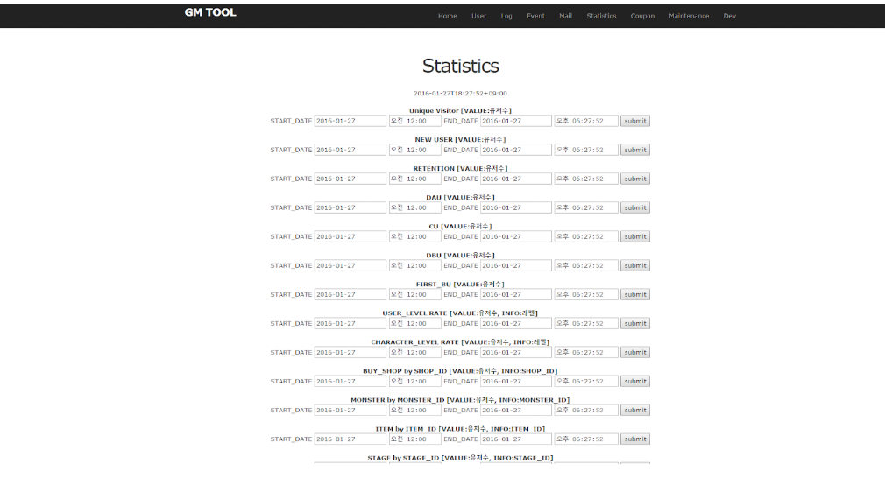
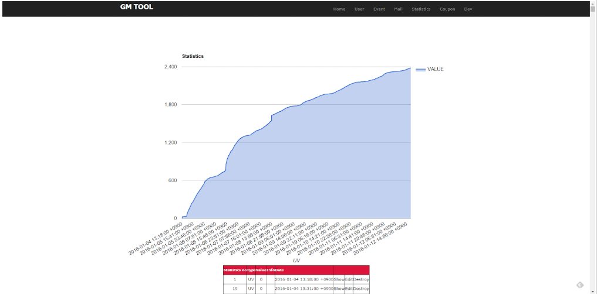

# rails_game_web

## enum
c# enum code defined excel files.

## rails_post_tool
c# excel to db tool.

## receipt_test
google receipt test.

## redis
redis binary.

## result_set
rails result to unity3d code. IDL.

## scaffold
rails scaffold files.

## schema
table defined excel files. (& generate files)

## test_tool
c# web_test_tool

## web_server
rails web server.
include admin-tool.

